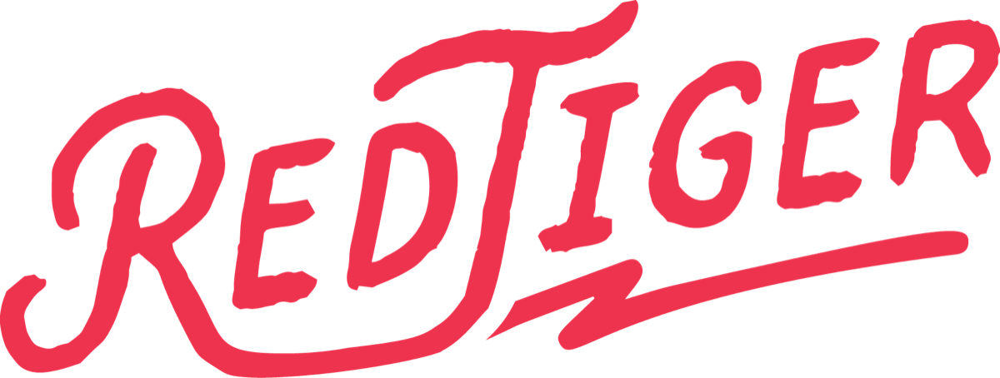
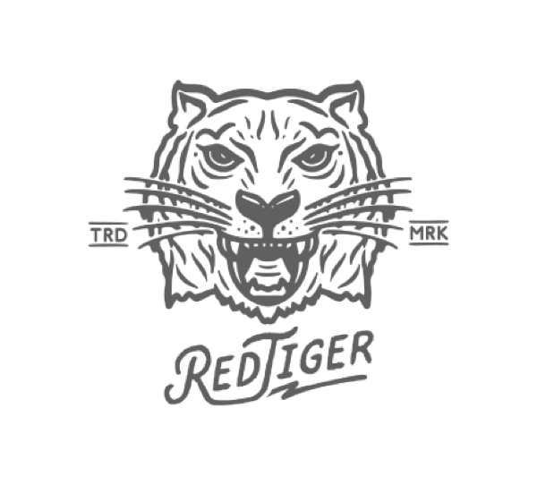

### Diseño y herramientas para gente que hace música y video

Apps de escritorio, instrumentos para navegador e identidad visual.
Hechas en México.

**[redtigerstudio.github.io](https://redtigerstudio.github.io)**

 

## Herramientas

<table>
<tr>
<td width="50%" valign="top">

### ⬛ [TIGER ENCODE](https://github.com/redtigerstudio/tiger-encode)

Conversor de video para macOS.
Rápido, local, sin suscripción.

`MP4` `H.265` `ProRes` `WEBM` `GIF`

**Disponible para descarga**

</td>
<td width="50%" valign="top">

### 🟧 [DubConvert](https://github.com/redtigerstudio/dubconvert)

Conversor de audio para macOS.
Lotes, forma de onda, espectro.

`MP3` `FLAC` `ALAC` `WAV` `OPUS`

**Disponible para descarga**

</td>
</tr>
<tr>
<td width="50%" valign="top">

### 🎛 [Dub Explorer](https://dub.redtiger.studio)

Consola de dub en vivo,
dentro del navegador.

`Stems` `FX` `Sampler` `MIDI` `Record`

**[▶ En vivo](https://dub.redtiger.studio)**

</td>
<td width="50%" valign="top">

### 🎺 [HORNS](https://horns.redtiger.studio)

La escala escrita como tú la lees.
Trompeta, trombón y saxofón.

`Afinador` `Metrónomo` `PWA`

**[▶ En vivo](https://horns.redtiger.studio)**

</td>
</tr>
</table>

 

## El estudio

**[redtiger.studio](https://redtiger.studio)** — diseño, video, animación, ilustración y música.

 

## Qué hago

Diseño de producto · Identidad visual · Motion graphics · Apps de escritorio · Instrumentos para navegador

 

---

*Made by Red Tiger Std*

